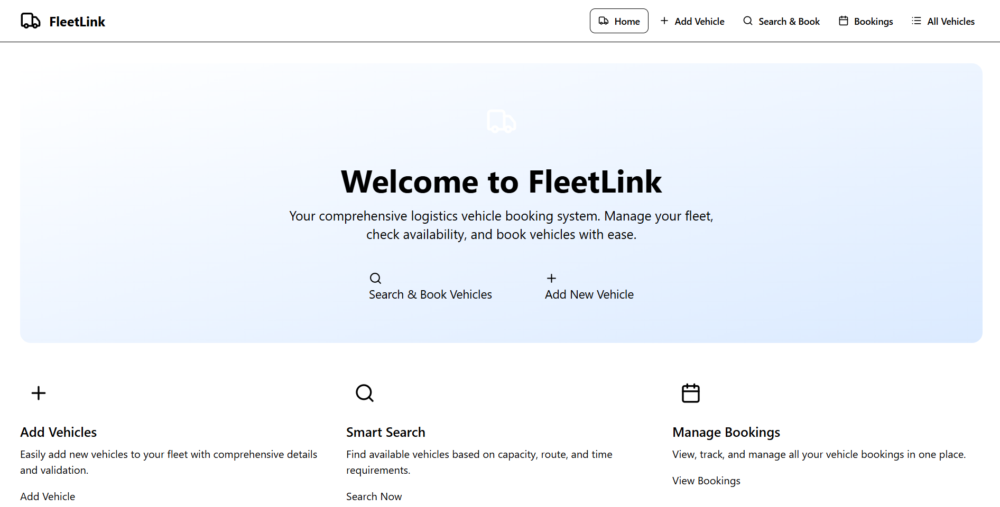
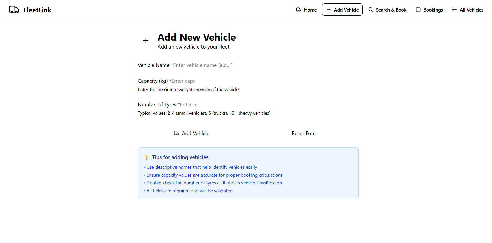
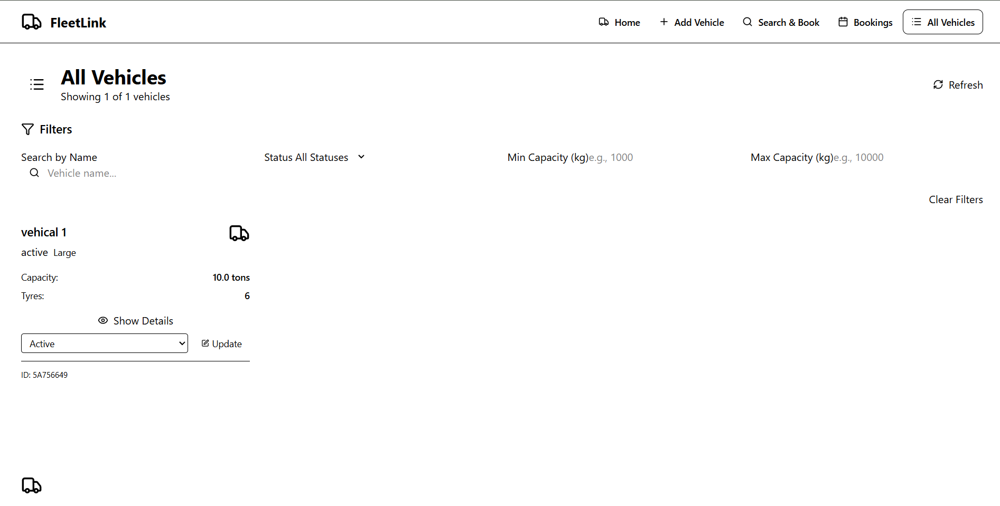
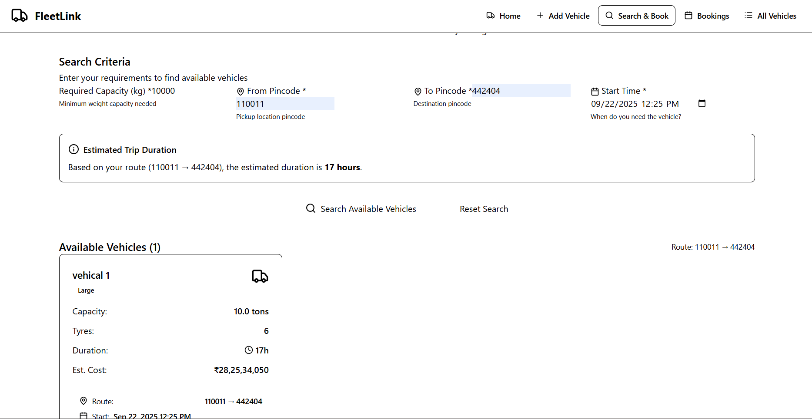
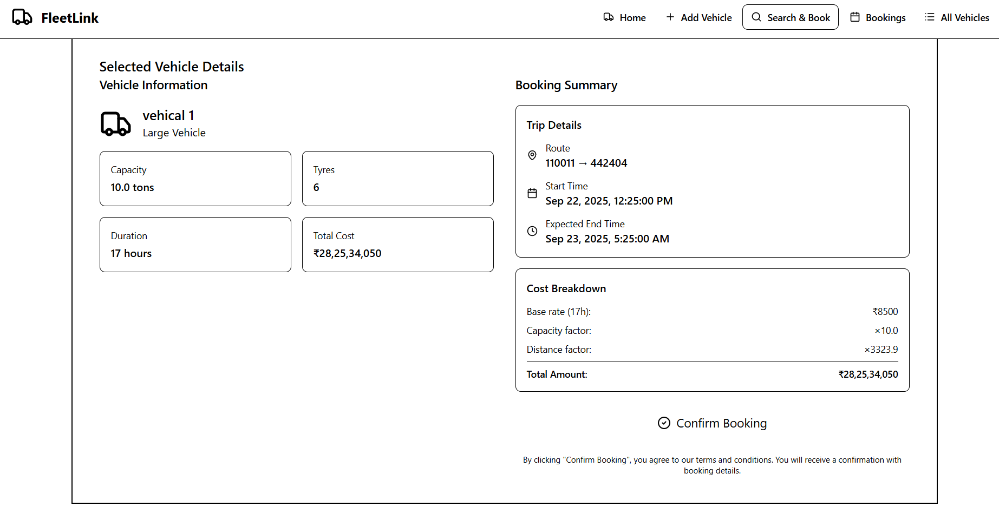

# FleetLink Frontend - Logistics Vehicle Booking System

A modern React frontend application for managing logistics vehicle bookings with a responsive design and intuitive user interface.

## 🚀 Features

- **Modern UI/UX**: Clean, responsive design with Tailwind CSS
- **Vehicle Management**: Add new vehicles with form validation
- **Smart Search**: Search available vehicles with real-time filtering
- **Booking System**: Book vehicles with confirmation and status tracking
- **Real-time Updates**: Live availability updates and notifications
- **Error Handling**: User-friendly error messages and recovery
- **Toast Notifications**: Real-time feedback for user actions

## 🛠️ Tech Stack

- **Framework**: React 19 with Hooks
- **Build Tool**: Vite for fast development and building
- **Styling**: Tailwind CSS for utility-first styling
- **Routing**: React Router DOM for navigation
- **HTTP Client**: Axios for API communication
- **Notifications**: React Hot Toast for user feedback
- **Icons**: Lucide React for consistent iconography
- **Date Handling**: date-fns for date utilities

## 📦 Installation

### Prerequisites

- Node.js (v16 or higher)
- npm or yarn

### Setup Steps

1. **Clone the repository**
   ```bash
   git clone <repository-url>
   cd fleetlink-system/frontend
   ```

2. **Install dependencies**
   ```bash
   npm install
   ```

3. **Environment Configuration**
   Create a `.env` file in the root directory:
   ```env
   VITE_BASE_API_URL=http://localhost:1234/api
   ```

4. **Start the development server**
   ```bash
   npm run dev
   ```

   The application will be available at `http://localhost:5173`

## 🌐 Pages & Components

### Main Pages

1. **Home Page (`/`)**
   - Dashboard with overview and quick actions
   - Navigation to all major features

2. **Add Vehicle (`/add-vehicle`)**
   - Form to add new vehicles to the fleet
   - Validation and error handling
   - Success confirmation

3. **Search & Book (`/search-book`)**
   - Vehicle search with filters
   - Real-time availability checking
   - One-click booking functionality

4. **Booking History (`/bookings`)**
   - View all bookings with filtering
   - Booking status management
   - Customer booking history

5. **Vehicle List (`/vehicles`)**
   - Complete fleet overview
   - Vehicle status management
   - Search and filtering

### Key Components

- **Navbar**: Responsive navigation with active state
- **Footer**: Application footer with links
- **ErrorBoundary**: Error catching and recovery
- **VehicleCard**: Reusable vehicle display component
- **LoadingSpinner**: Loading state indicators
- **ToastNotifications**: User feedback system

## Screenshots

### Home Page


### Add Vehicle Page


### Vehicle List Page


### Book Vehicle Page


